<!-- ╔══════════════════════════════════════════════════════════════╗ -->
<!-- ║      PROXMOX VIRTUAL ENV · INS Sa Palomera                 ║ -->
<!-- ║     Izan Ruiz · Youssef Fouad · Adrià Rodríguez            ║ -->
<!-- ╚══════════════════════════════════════════════════════════════╝ -->

<div align="center">

```
██████╗ ██████╗  ██████╗ ██╗  ██╗███╗   ███╗ ██████╗ ██╗  ██╗
██╔══██╗██╔══██╗██╔═══██╗╚██╗██╔╝████╗ ████║██╔═══██╗╚██╗██╔╝
██████╔╝██████╔╝██║   ██║ ╚███╔╝ ██╔████╔██║██║   ██║ ╚███╔╝ 
██╔═══╝ ██╔══██╗██║   ██║ ██╔██╗ ██║╚██╔╝██║██║   ██║ ██╔██╗ 
██║     ██║  ██║╚██████╔╝██╔╝ ██╗██║ ╚═╝ ██║╚██████╔╝██╔╝ ██╗
╚═╝     ╚═╝  ╚═╝ ╚═════╝ ╚═╝  ╚═╝╚═╝     ╚═╝ ╚═════╝ ╚═╝  ╚═╝
```

### `Proxmox VE 9.1` · `TrueNAS SCALE` · `RAID 1` · `NFS` · `VirtualBox`


**Projecte Final de Curs 2025–2026 · ASIX – Administració de Sistemes Informàtics en Xarxa**

*Izan Ruiz · Youssef Fouad · Adrià Rodríguez*

</div>

---

## 📋 Índex

- [📖 Introducció i Elecció](#-introducció-i-elecció)
- [🗺️ Arquitectura de xarxa](#️-arquitectura-de-xarxa)
- [⚙️ FASE 1 – Instal·lació de Proxmox](#️-fase-1--installació-de-proxmox)
  - [Pas 1 – Creació de la VM a VirtualBox](#pas-1--creació-de-la-vm-a-virtualbox)
  - [Pas 2 – Instal·lació de l'Hypervisor](#pas-2--installació-de-lhypervisor)
  - [Pas 3 – Accés a la interfície de gestió](#pas-3--accés-a-la-interfície-de-gestió)
- [🖥️ FASE 2 – Creació de l'Entorn Virtual](#️-fase-2--creació-de-lentorn-virtual)
  - [Desplegament de TrueNAS](#1-desplegament-de-la-màquina-virtual-truenas)
  - [Configuració de Xarxa](#2-configuració-de-xarxa)
  - [Implementació RAID 1](#3-implementació-demmagatzematge-raid-1)
  - [Transferència NFS](#31-transferència-de-fitxers-i-gestió-del-datastore-remot)
  - [Provisió de VMs](#32-provisió-de-màquines-virtuals-utilitzant-el-recurs-nfs)
- [👥 Autors](#-autors)

---

## 📖 Introducció i Elecció

Aquest projecte desplega un **entorn de virtualització complet** basat en **Proxmox VE**, integrant un servidor d'emmagatzematge **TrueNAS SCALE** amb redundància **RAID 1** i compartició de recursos via **NFS**.

### Per què Proxmox VE?

| Característica | ESXi (VMware) | **Proxmox VE** | Hyper-V | IsardVDI |
|---|---|---|---|---|
| Llicència | Propietari (cara) | **Open Source (GPL)** | Propietari | Open Source |
| Base Kernel | Propi | **Debian Linux** | Windows Server | KVM/Docker |
| Virtualització | VM | **VM + LXC** | VM | VDI |
| Dificultat | Mitjana | **Mitjana/Baixa** | Baixa | Alta |
| Ideal per a | Grans empreses | **Pimes i Labs** | Entorns Windows | Centres educatius |

> 💡 **Justificació:** Proxmox VE és una solució de codi obert basada en Debian que combina la virtualització **KVM** (màquines virtuals) i **LXC** (contenidors). A diferència d'ESXi, no té limitacions de llicència per a ús educatiu i permet una gestió total des del navegador.

---

## 🗺️ Arquitectura de xarxa

```
┌──────────────────────────────────────────────────────────────────┐
│                        HOST WINDOWS (PC físic)                   │
│                                                                  │
│   ┌──────────────────────────────────────────────────────────┐   │
│   │                    VirtualBox                            │   │
│   │                                                          │   │
│   │  ┌─────────────────────┐    ┌──────────────────────────┐ │   │
│   │  │   PROXMOX VE 9.1    │    │     TrueNAS SCALE        │ │   │
│   │  │                     │    │                          │ │   │
│   │  │ vmbr0 192.168.56.100│◄──►│ enp0s9  192.168.56.101  │ │   │
│   │  │ (Host-Only – Gestió)│    │ (Host-Only – Gestió Web) │ │   │
│   │  │                     │    │                          │ │   │
│   │  │ vmbr1  10.0.0.1/24  │◄──►│ enp0s8  10.0.0.2/24     │ │   │
│   │  │ (Red Interna – NFS) │    │ (Red Interna – Dades)    │ │   │
│   │  │                     │    │                          │ │   │
│   │  │ NAT (Internet)      │    │ enp0s3  10.0.2.15 (NAT) │ │   │
│   │  └─────────────────────┘    └──────────────────────────┘ │   │
│   │                          ▲                                │   │
│   │                   NFS Mount (ZFS RAID 1)                  │   │
│   └──────────────────────────────────────────────────────────┘   │
└──────────────────────────────────────────────────────────────────┘
```

| Element | Interfície | Adreça IP | Tipus (VirtualBox) |
|---|---|---|---|
| 🖥️ Proxmox | `vmbr0` (nic1) | `192.168.56.100/24` | Host-Only |
| 🖥️ Proxmox | `vmbr1` (enp0s9) | `10.0.0.1/24` | Red Interna |
| 💾 TrueNAS | `enp0s9` | `192.168.56.101/24` | Host-Only |
| 💾 TrueNAS | `enp0s8` | `10.0.0.2/24` | Red Interna |
| 💾 TrueNAS | `enp0s3` | `10.0.2.15/24` | NAT |

**Tipus de xarxa:**
- **Host-Only** → Accés web a les consoles de gestió (Proxmox i TrueNAS) des del PC amfitrió
- **Red Interna** → Canal privat per al trànsit NFS/ZFS entre l'hypervisor i el NAS
- **NAT** → Connectivitat a Internet per actualitzacions i descàrrega de repositoris

---

## ⚙️ FASE 1 – Instal·lació de Proxmox

### Pas 1 – Creació de la VM a VirtualBox


La màquina `Proxmox_Projecte` s'ha creat a VirtualBox amb la ISO de **Proxmox VE 9.1**, tipus **Linux / Debian (64-bit)**.

**Recursos assignats:**

| Recurs | Valor | Justificació |
|---|---|---|
| 💾 RAM | `8 GB` | Proxmox necessita ~2 GB + TrueNAS requereix 4-8 GB per ZFS |
| 🔲 CPU | `2 nuclis` | Rendiment mínim per virtualització nested |
| 💿 Disc | `50 GB` | Sistema operatiu Proxmox |

**Adaptadors de xarxa configurats:**

| Adaptador | Mode | Funció |
|---|---|---|
| Adaptador 1 | NAT | Accés a Internet per actualitzacions |
| Adaptador 2 | Host-Only | Consola web des del PC físic |
| Adaptador 3 | Red Interna (`xarxa_proxmox`) | Comunicació amb TrueNAS |

---

### Pas 2 – Instal·lació de l'Hypervisor


Durant l'instal·lador gràfic de Proxmox VE:

**Disc:** `/dev/sda` (50.00 GiB, VBOX HARDDISK)


**Localització:** `Spain` · `Europe/Madrid` · `Spanish`


**Configuració de xarxa de gestió:**

```
Management Interface : nic1 (Host-Only)
Hostname (FQDN)      : pve.projecte.com
IP Address (CIDR)    : 192.168.56.100/24
Gateway              : 192.168.56.1
DNS Server           : 8.8.8.8
```

> ⚠️ S'ha assignat la IP de forma **estàtica** per garantir que l'adreça de la consola de gestió no canviï mai.

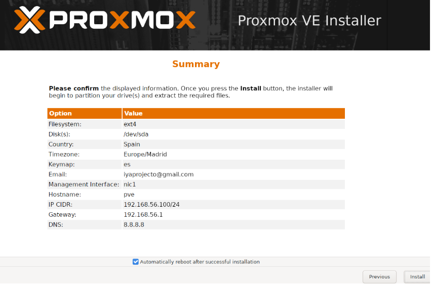

---

### Pas 3 – Accés a la interfície de gestió

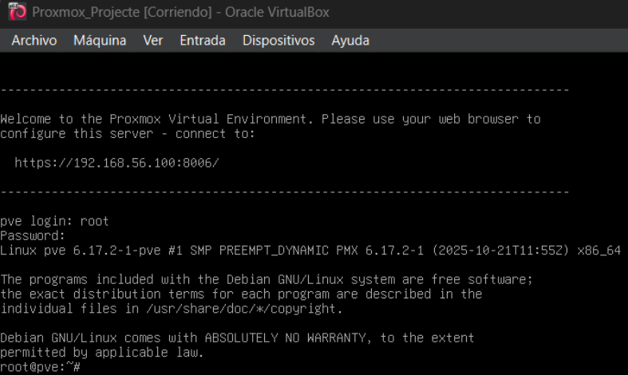

Un cop instal·lat, Proxmox indica la URL d'accés:

```
https://192.168.56.100:8006/
```

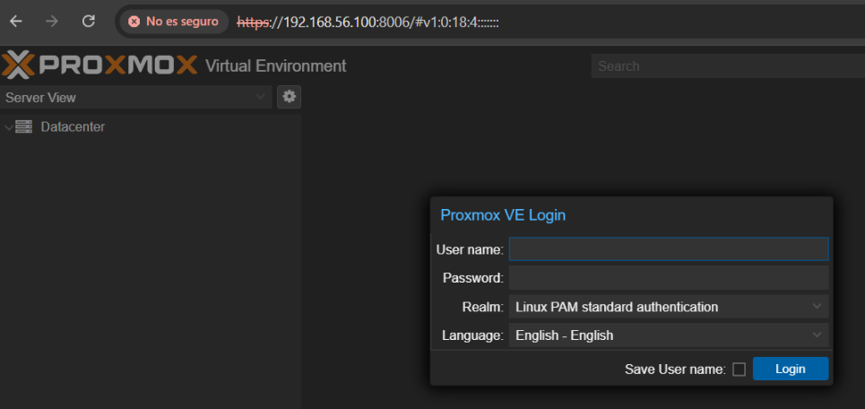

Accedim via **HTTPS** amb l'usuari `root` i verifiquem que el panell de control és accessible. ✅

---

## 🖥️ FASE 2 – Creació de l'Entorn Virtual

### 1. Desplegament de la Màquina Virtual (TrueNAS)


S'ha creat una segona VM independent per allotjar el **TrueNAS SCALE 25.10.0.1**:

| Recurs | Valor |
|---|---|
| 💾 RAM | `4 GB` |
| 🔲 CPU | `2 nuclis` |
| 💿 Disc SO | `32 GB` |
| 💿 Disc Dades | `50 GB × 2` (per al RAID 1) |
| 🖥️ SO Guest | FreeBSD (64-bit) |

---

### 2. Configuració de Xarxa


Es defineix la topologia de **xarxa interna** anomenada `xarxa_proxmox` per connectar l'hypervisor i el NAS, aïllant el trànsit de dades de la xarxa domèstica.

**Pas 1 – Bridge vmbr1 a Proxmox:**

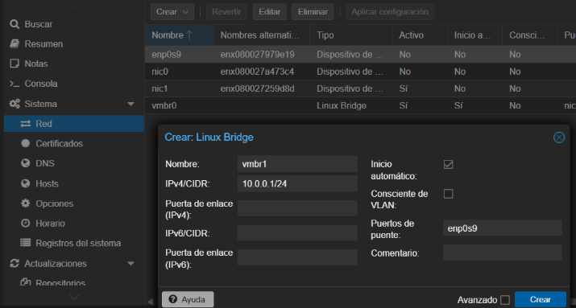

```
Bridge: vmbr1
IP:     10.0.0.1/24
Port:   enp0s9  (Red Interna de VirtualBox)
```

**Pas 2 – Configuració aplicada:**

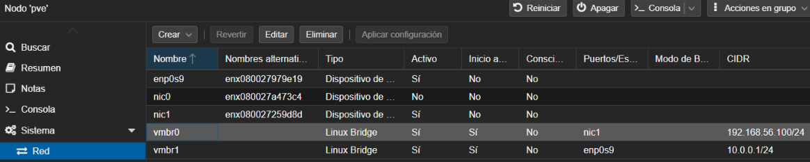

| Bridge | CIDR | Funció |
|---|---|---|
| `vmbr0` | `192.168.56.100/24` | Gestió web (Host-Only) |
| `vmbr1` | `10.0.0.1/24` | Transferència NFS (Red Interna) |

---

### 3. Implementació d'Emmagatzematge (RAID 1)

**Pas 1 – Hardware per a RAID 1:**


S'han afegit **dos discs virtuals de 50 GB** per implementar tolerància a fallades. En mode **Mirror (RAID 1)**, les dades es dupliquen simultàniament en ambdós discos.

**Pas 2 – Instal·lació de TrueNAS SCALE:**


- **Disc SO:** `sdb` → 32 GiB (sistema operatiu TrueNAS)
- **Disc Dades:** `sda` → 50 GiB (reservat per al pool ZFS)

**Pas 3 – IP interna del TrueNAS:**

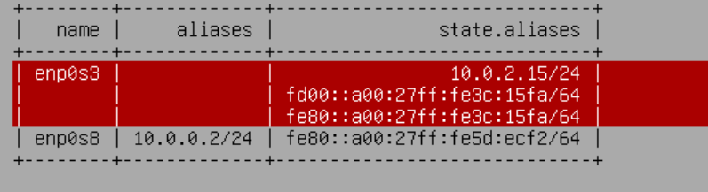

```
enp0s8 → 10.0.0.2/24   (Red Interna – NFS)
enp0s9 → 192.168.56.101/24  (Host-Only – Web)
```

**Verificació de connectivitat:**

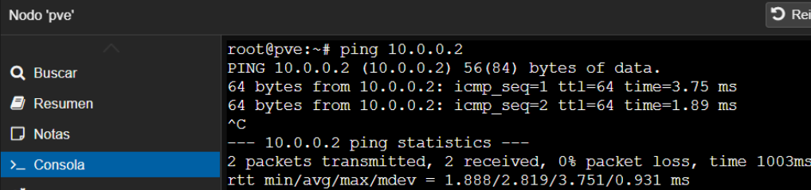

```bash
root@pve:~# ping 10.0.0.2
# 2 packets transmitted, 2 received, 0% packet loss
```

✅ Proxmox i TrueNAS es veuen per la xarxa interna.

**Pas 4 – Creació del Pool RAID 1 (TrueNAS Web):**

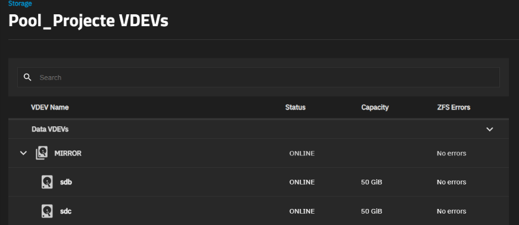

S'ha creat el pool `Pool_Projecte` en mode **Mirror (RAID 1)**:

```
Pool:     Pool_Projecte
Mode:     1 x MIRROR | 2 wide | 50 GiB
Discs:    sdb (50 GiB) + sdc (50 GiB)
Estat:    ONLINE – No errors
Cap. útil: 47.48 GiB
```

**Pas 5 – Compartició NFS:**

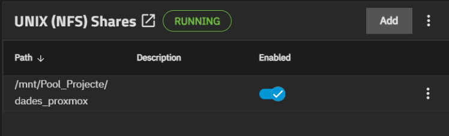

1. Creem el dataset `dades_proxmox` dins del `Pool_Projecte`
2. Afegim un **NFS Share** apuntant a `/mnt/Pool_Projecte/dades_proxmox`
3. Configurem la xarxa autoritzada: `10.0.0.0/24`

```
Path:    /mnt/Pool_Projecte/dades_proxmox
Network: 10.0.0.0/24
Estat:   RUNNING ✅
```

---

### 3.1 Transferència de fitxers i gestió del Datastore remot

**Connexió NFS a Proxmox:**

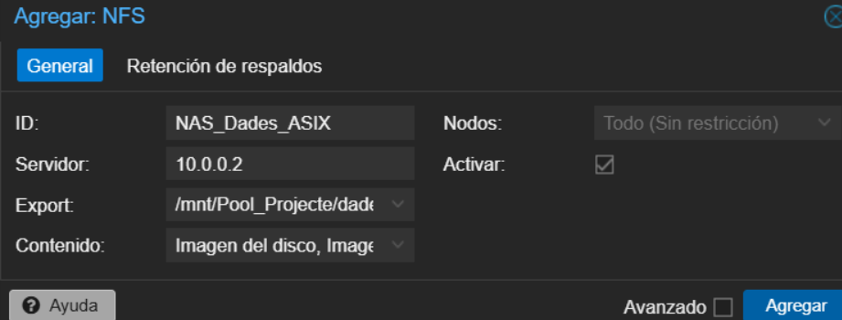


Des del **Datacenter → Almacenamiento → Agregar → NFS**:

```
ID:        NAS_Dades_ASIX
Servidor:  10.0.0.2
Export:    /mnt/Pool_Projecte/dades_proxmox
Contingut: Imatges ISO, Discs VM, Backups
```

> ⚠️ **Error de permisos resolt:** S'ha hagut de configurar el `Maproot User = root` a les opcions avançades del share NFS de TrueNAS per permetre que Proxmox tingui permisos d'escriptura sobre el dataset.

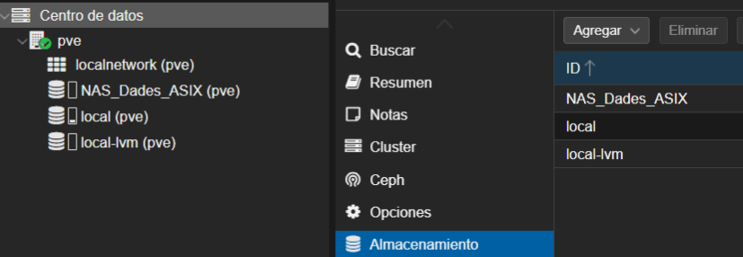


**Càrrega d'ISO al volum ZFS:**

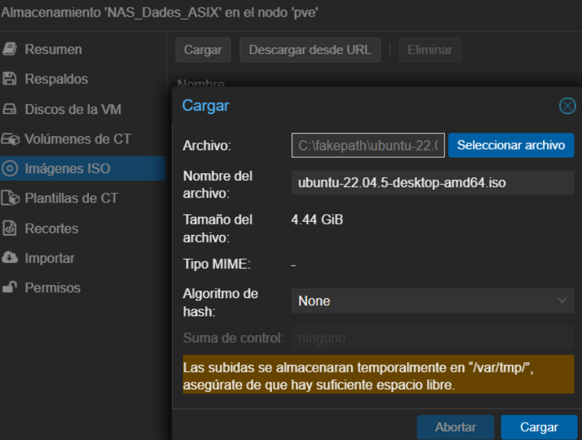


S'ha carregat la ISO `ubuntu-22.04.5-desktop-amd64.iso` (4.44 GiB) al recurs NFS `NAS_Dades_ASIX` per verificar permisos de lectura/escriptura.

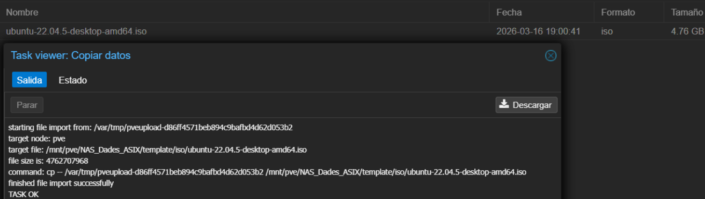


```
finished file import successfully
TASK OK ✅
```

---

### 3.2 Provisió de màquines virtuals utilitzant el recurs NFS

En aquest apartat es crea una VM dins de Proxmox que utilitza **exclusivament el NAS remot** tant per a la imatge ISO com per al disc dur virtual.

**Pas 9 – Font d'instal·lació remota:**


```
Emmagatzematge ISO: NAS_Dades_ASIX
Imatge:             ubuntu-22.04.5-desktop-amd64.iso
SO Guest:           Linux 6.x - 2.6 Kernel
```

**Pas 10 – Disc virtual al RAID 1:**


```
Controlador:    VirtIO SCSI
Emmagatzematge: NAS_Dades_ASIX   ← disc físic al RAID 1 del TrueNAS
Mida:           12 GiB
Format:         QCOW2
```

> 💡 En cas de fallada del node Proxmox, les dades de la VM queden protegides al NAS.

**Resolució d'errors:**

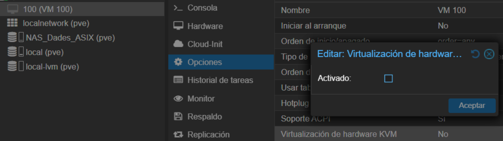


Per executar la VM sobre VirtualBox (virtualització nested), cal desactivar la virtualització KVM:
`Opcions → Virtualización de hardware KVM → Desactivat`

**Resultat final:**

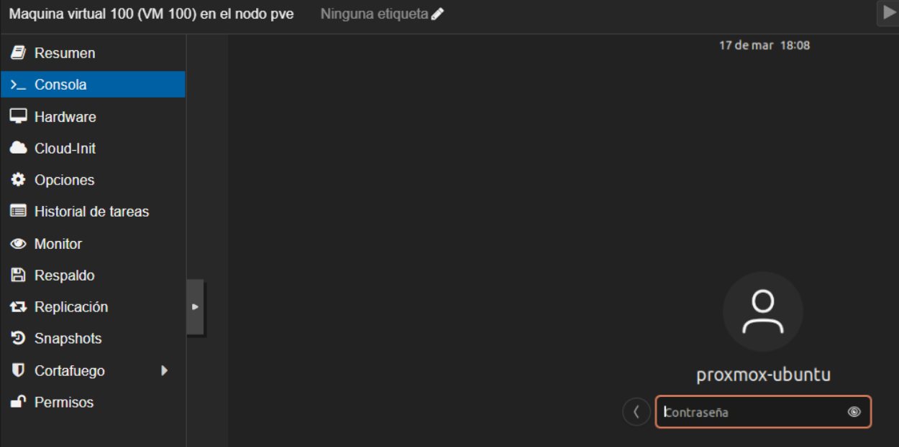


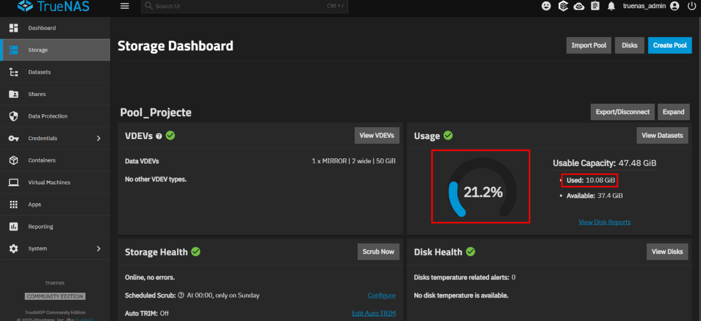


El dashboard de **TrueNAS** confirma la integració completa del sistema:

```
Pool_Projecte
├── Mode:      1 x MIRROR | 2 wide | 50 GiB  (RAID 1)
├── Ús:        21.2%  →  10.08 GiB usats
├── Lliure:    37.4 GiB
└── Estat:     Storage Health ✅ · Disk Health ✅
```

El sistema ZFS gestiona en **temps real** les dades enviades per l'hypervisor a través de la xarxa interna, protegint-les amb el **mode Mirror (RAID 1)** configurat.

---

## 👥 Autors

<div align="center">

| | Nom |
|---|---|
| 👤 | **Izan Ruiz** |
| 👤 | **Youssef Fouad** |
| 👤 | **Adrià Rodríguez** |

**INS Sa Palomera · ASIX · Projecte Final de Curs 2025–2026**


</div>
