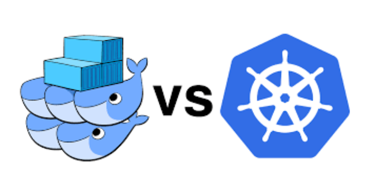

# Orquestradors: Docker Swarm i Kubernetes

**Izan Ruiz, Adria Rodriguez, Youssef Fouad**

---

## Índex
- **FASE 1: Docker Compose – Entorn de Desenvolupament** (3)
  1. Introducció (3)
  2. Disseny de l'arquitectura (4)
  3. Creació i configuració del fitxer index.html (5)
  4. Creació i configuració del fitxer docker-compose.yml (6)
  5. Desplegament i verificació del sistema (7)
- **Fase 2: Docker Swarm — Clúster d'Alta Disponibilitat** (8)
  1. Infraestructura i configuració de xarxa (8)
  2. Inicialització del clúster Swarm (9)
  3. Creació del fitxer docker-stack.yml (10)
  4. Desplegament i verificació dels serveis (10)
  5. Prova de tolerància a fallades (11)
  6. Escalat en calent (12)
- **Fase 3: Seguretat a Docker Swarm** (12)
  1. Anàlisi de vulnerabilitats (12)
  2. Migració a Docker Secrets (12)
  3. Aïllament de xarxes Overlay (13)
  4. TLS i certificats al clúster (14)
  5. Imatge segura (Trivy) (15)
- **Fase 4: Kubernetes — Migració i Gestió Avançada** (16)
  1. Estudi i comparativa: Docker Swarm vs Kubernetes (16)
  2. Preparació de l'entorn: Instal·lació de Minikube (16)
  3. Creació de fitxers YAML per a Kubernetes (17)
  4. Namespace: Aïllament de recursos (18)
  5. Migració i desplegament (18)
  6. Verificació d'accés extern (19)
  7. Rolling update (19)
  8. Comprovació dels fluxos funcionals (20)
- **Fase 5: Conclusió final** (21)

---

## FASE 1: Docker Compose – Entorn de Desenvolupament
L'objectiu d'aquesta fase és aixecar tota la plataforma ShopMicro localment.

### 1. Introducció
**Què és Docker Compose?**
Docker Compose és una eina que permet definir i executar aplicacions multi-contenidor. En lloc d'aixecar cada contenidor manualment amb docker run, fem servir un fitxer de configuració YAML on definim tots els serveis, xarxes i volums.

**Arquitectura i Sintaxi YAML:**
El fitxer docker-compose.yml fa servir espais al començament de les línies per organitzar i definir els seus elements:
- **Services:** Cada microservei.
- **Networks:** Xarxes aïllades perquè els contenidors es comuniquin.
- **Volumes:** Persistència de dades per a les bases de dades.

**Diferències amb docker run:**
Mentre que docker run és ideal per a contenidors aïllats, el Compose permet gestionar tot el cicle de vida de múltiples contenidors amb una sola comanda, docker compose up -d, assegurant que les dependències i les xarxes estiguin correctament configurades des del principi.

### 2. Disseny de l'arquitectura
Hem dissenyat una arquitectura basada en microserveis seguint els requeriments del cas d'ús. El sistema es divideix en dues xarxes lògiques: frontend-net (pública) i backend-net (privada).

**Explicació:** El diagrama mostra el flux de dades des de l'usuari cap al frontend. L' api-gateway actua com a punt d'entrada únic cap als microserveis de negoci. Es pot observar com el servei de comandes (order-service) interactua amb la base de dades, el sistema de memòria cau i la cua de missatgeria per notificar esdeveniments de forma asíncrona.

### 3. Creació i configuració del fitxer index.html
Hem creat un fitxer index.html per personalitzar la interfície de la botiga ShopMicro.

### 4. Creació i configuració del fitxer docker-compose.yml
Hem programat un fitxer docker-compose.yml que aixeca els 10 contenidors necessaris. S'han configurat Healthchecks específics per a les bases de dades i el RabbitMQ per evitar que els microserveis intentin connectar-se abans que els serveis d'infraestructura estiguin totalment operatius (service_healthy).

### 5. Desplegament i verificació del sistema
Per al desplegament de l'entorn, hem utilitzat la comanda docker compose up -d. Un cop finalitzat el procés.

Per verificar la integritat de tots els serveis amb la comanda docker compose ps.
Finalment, per confirmar que tot funciona correctament, accedim a la plataforma.

---

## Fase 2: Docker Swarm — Clúster d'Alta Disponibilitat

### 1. Infraestructura i configuració de xarxa
Per al muntatge del clúster d'alta disponibilitat, hem desplegat tres màquines virtuals amb Ubuntu Server 22.04. Hem optat per una configuració de xarxa de doble interfície:

- **swarm-manager:**
- **swarm-worker-1:**
- **swarm-worker-2:**

### 2. Inicialització del clúster Swarm
Hem inicialitzat el clúster a través de la interfície de xarxa interna (10.0.0.10) per garantir la seguretat del trànsit de gestió. Els nodes treballadors s'han unit mitjançant un token de seguretat.

### 3. Creació del fitxer docker-stack.yml
S'ha creat el fitxer docker-stack.yml. S'han configurat 2 rèpliques per als serveis d'API i gateway per garantir la tolerància a fallades, i s'han definit xarxes de tipus overlay.

### 4. Desplegament i verificació dels serveis
Un cop configurat el fitxer, hem procedit al desplegament del stack anomenat shopmicro. Swarm s'ha encarregat de descarregar les imatges a tots els nodes i repartir els contenidors.

En aquesta captura es pot observar com la columna REPLICAS mostra, per exemple, 2/2 en els serveis escalats, indicant que Swarm ha aixecat correctament totes les instàncies demanades.

S'observa la distribució dels contenidors entre els nodes swarm-manager, worker-1 i worker-2. Es confirma que les bases de dades estan al manager i la resta de serveis repartits pel clúster.

### 5. Prova de tolerància a fallades
Hem simulat una fallada crítica aturant el servei de Docker al node swarm-worker-2. L'orquestrador Swarm ha detectat la caiguda del node en pocs segons i ha reprogramat automàticament les instàncies afectades cap als nodes actius, garantint que el servei no s'aturi en cap moment.

### 6. Escalat en calent
Hem realitzat un escalat horitzontal del microservei product-service augmentant el nombre de rèpliques de 2 a 4. El procés s'ha realitzat sense temps d'aturada.

---

## Fase 3: Seguretat a Docker Swarm

### 1. Anàlisi de vulnerabilitats
Hem realitzat una auditoria del fitxer docker-stack.yml utilitzat a la Fase 2 i hem detectat una vulnerabilitat crítica: les credencials de les bases de dades (MYSQL_ROOT_PASSWORD) estan escrites en text pla. Qualsevol persona amb accés al fitxer podria comprometre la seguretat de les dades.

### 2. Migració a Docker Secrets
Per protegir les credencials, farem servir el gestor de secrets natiu de Docker Swarm, que emmagatzema la informació xifrada en el clúster.

Es crea un objecte tipus secret anomenat db_root_password. L'ús del guio (-) permet que Docker llegeixi la contrasenya des de l'entrada estàndard (echo), evitant que la contrasenya quedi registrada de forma permanent en l'historial de comandes del sistema.

Després s'edita el fitxer docker-stack.yml. S'elimina la variable MYSQL_ROOT_PASSWORD i s'introdueix MYSQL_ROOT_PASSWORD_FILE: /run/secrets/db_root_password. També s'afegeix la secció secrets al final del fitxer. Això força el contenidor a llegir la contrasenya des d'un sistema de fitxers temporal en memòria.

S'aplica la nova configuració al clúster. Swarm realitza un "Rolling Update" dels serveis afectats per injectar-los el nou secret sense perdre la disponibilitat del servei.

### 3. Aïllament de xarxes Overlay
Cal assegurar que els contenidors només parlin amb qui realment necessiten.

Es comprova que existeixen dues xarxes separades: frontend-net i backend-net.

Aquesta comanda ens retorna l'ID de la xarxa a la qual està connectat el frontend. Podem comprovar que només apareix un ID, que correspon a la xarxa frontend-net. Això demostra que el servei està aïllat de la xarxa de dades.

Aquí veurem dos IDs de xarxa. Això confirma que l' api-gateway actua com a pont entre la xarxa pública (frontend-net) i la xarxa privada de microserveis (backend-net).

Es verifica que la base de dades només té assignada la xarxa de dades. Com que no té connexió amb frontend-net, cap atacant des de l'exterior podria arribar a la base de dades encara que conegués la seva IP interna.

### 4. TLS i certificats al clúster
En aquesta captura podem veure que el node actua com a Manager i té un ClusterID únic. Docker Swarm genera automàticament una CA interna. Tots els nodes es comuniquen mitjançant mTLS, el que significa que les dades que viatgen entre el manager i els workers del teu VirtualBox estan xifrades per defecte.

### 5. Imatge segura (Trivy)

**Anàlisi de la vulnerabilitat:**
Hem detectat una vulnerabilitat CRÍTICA (CVE-2025-68121). El problema resideix en la llibreria de xifratge TLS, fet que podria permetre a un atacant interceptar comunicacions segures.

**Mesures:**
- **Actualització:** Descarregar la versió més recent de la imatge de MySQL, on els desenvolupadors ja han corregit l'error.
- **Simplificació:** Utilitzar imatges més lleugeres que porten menys fitxers i, per tant, tenen menys punts febles per on ens poden atacar.
- **Prevenció:** Passar l'eina Trivy de forma periòdica per detectar nous problemes abans que algú els pugui aprofitar.

---

## Fase 4: Kubernetes — Migració i Gestió Avançada

### 1. Estudi i comparativa: Docker Swarm vs Kubernetes

| Característica | Docker Swarm | Kubernetes |
| :--- | :--- | :--- |
| **Escalat** | Manual. | Automàtic. |
| **Recuperació (Self-healing)** | Bàsic. Si un contenidor cau o el node es desconnecta, reinicia les instàncies. | Avançat. Utilitza Liveness i Readiness probes per comprovar si l'App respon realment. |
| **Rolling Updates** | Seqüencial. Substitueix els contenidors un per un de forma simple. | Controlat. Permet definir estratègies detallades i fer rollbacks ràpids si l'actualització falla. |
| **Gestió de Secrets** | Docker Secrets. Integrat i fàcil de gestionar via fitxers al directori /run/secrets. | K8s Secrets. Objectes natius que permeten ser muntats com a volums o variables d'entorn. |
| **Networking** | Basat en xarxes overlay i el VIP del servei per al balanceig. | Basat en Services i Ingress per a la gestió de rutes externes. |

### 2. Preparació de l'entorn: Instal·lació de Minikube
- Instal·lació Minikube:
- Instal·lació Kubectl:

Configurem kubectl per gestionar el clúster.

### 3. Creació de fitxers YAML per a Kubernetes
Creem la carpeta per als YAML:

Hem definit els manifests de Kubernetes incloent objectes Deployment, Service, ConfigMap i Secret. Hem configurat Liveness i Readiness probes per garantir l'auto-curació del servei.

Hem creat un fitxer frontend.yaml que utilitza un ConfigMap per carregar el fitxer index.html. Això permet que el servidor Nginx serveixi la nostra web de la botiga sense haver de modificar la imatge de Docker original.

### 4. Namespace: Aïllament de recursos
Hem creat el namespace shopmicro per aïllar tots els recursos del projecte i mantenir el clúster organitzat.

### 5. Migració i desplegament
Hem aplicat els manifests al clúster de Minikube. Kubernetes ha creat automàticament el Pod, el servei i ha injectat les configuracions i secrets.

### 6. Verificació d'accés extern
Verifiquem l'accés a la plataforma ShopMicro a través del navegador mitjançant un túnel de Minikube.

### 7. Rolling update
Primer verifiquem la versió actual.

Ara demanarem a Kubernetes que canviï la imatge a la versió 8.4.

En aquesta captua es pot veure que mentre el node nou (ContainerCreating) s’està preperant amb la nova versió (8.4), el node antic continua en estat Running. 
I quan l’actualització termina ens surt noves linies confirmant que el servei es manté sempre actiu durant tota l'actualització.

Verifiquem que l’actualització s’ha completat amb èxit

### 8. Comprovació dels fluxos funcionals
**Flux 1 i 2: Comunicació entre microserveis**
L'objectiu d’aquest flux és demostrar que els microserveis es poden trobar entre ells (frontend –> gateway –> serveis –> bases de dades).

**Prova de connectivitat interna (PING):**
En aquesta captura mitjançant l'execució d'un ping des d'un Pod de prova cap al servei db-products, es confirma que el trànsit de dades flueix correctament a través del clúster de Kubernetes. 

**Resolució de noms (DNS/Service Discovery):**
Aquesta captura confirma que el Service Discovery de Kubernetes funciona perfectament. S'ha realitzat una consulta de noms (nslookup) des d'un pod de prova cap al servei db-products. Això és molt important perquè el microservei de productes pugui consultar la base de dades i enviar la informació al frontend.

**Flux 3: Fallada i recuperació**
L'objectiu d'aquesta prova és demostrar que si un microservei de la ShopMicro falla o s'elimina per error, Kubernetes detecta el problema i el torna a aixecar per garantir que la botiga continuï funcionant.

Abans de provocar la fallada, hem de veure què tenim funcionant i quant de temps porten encesos els contenidors.

Ara eliminarem el contenidor de la base de dades manualment.

Tornem a executar la comanda anterior i podem veure com a reaccionat Kubernetes.

---

## Fase 5: Conclusió final
Després d'haver completat les quatre fases del projecte ShopMicro, hem realitzat una conclusió final, primer en realitzat una taula comparativa entre els tres entorns:

| Criteri | Docker Compose | Docker Swarm | Kubernetes (K8s) |
| :--- | :--- | :--- | :--- |
| **Infraestructura** | Una sola màquina. | Clúster de diversos nodes. | Clúster complex (múltiples objectes). |
| **Recuperació (Self-healing)** | No hi ha. | Bàsica. | Avançada. |
| **Facilitat d'ús** | Molt alta. | Mitjana. | Baixa (molt d'aprenentatge). |
| **Escalabilitat** | No escalable. | Escalat manual de rèpliques. | Escalat automàtic i dinàmic. |

Per a posar ShopMicro en producció, la millor opció és Kubernetes. Encara que és el sistema més difícil de configurar i costa molt més d’aprendre, val la pena per la seguretat que dóna.

Els motius principals són el Self-healing, que fa que si un microservei falla, Kubernetes se n'adoni i l'arregli sol en segons, i el Rolling Update, que permet actualitzar la web mentre la gent està comprant sense haver de tancar-la ni un moment.

Com a conclusió, aquest projecte ens ha ensenyat que Docker Compose va molt bé per treballar a casa i fer proves ràpides, Swarm serveix per a coses mitjanes si no et vols complicar la vida, però per a una empresa gran que no pot fallar mai, Kubernetes és l’eina que s'ha de fer servir.
