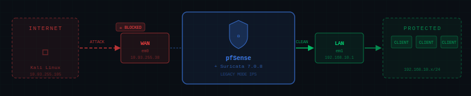
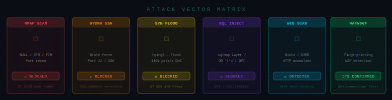
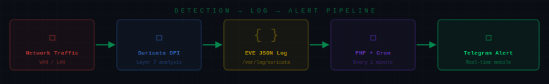

<p align="center">
  
</p>

<p align="center">
  
</p>

<p align="center">
  
</p>

<p align="center">
  
</p>

---

<div align="center">

[](https://semver.org/)
[](LICENSE)
[](https://pfsense.org)
[](https://suricata.io)
[](https://rules.emergingthreats.net)
[]()

</div>

---

## 🛡️ Implementació d'IDS/IPS amb Suricata sobre pfSense

Projecte acadèmic de ciberseguretat que demostra la implementació d'un sistema de **Detecció i Prevenció d'Intrusions** sobre un tallafocs pfSense, amb proves de pentesting reals des de Kali Linux.

---

## 📑 Índex

1. [Arquitectura del Projecte](#-arquitectura-del-projecte)
2. [Tecnologies Utilitzades](#-tecnologies-utilitzades)
3. [Característiques Principals](#-característiques-principals)
4. [Auditoria i Pentesting](#-auditoria-i-pentesting-casos-dús)
5. [Automatització i Sistemes Complementaris](#-automatització-i-sistemes-complementaris)
6. [Optimització de Rendiment](#-optimització-de-rendiment)
7. [Autors](#-autors)

---

## 🏗️ Arquitectura del Projecte

L'entorn s'ha desplegat mitjançant màquines virtuals (VirtualBox) simulant una infraestructura de xarxa perimetral real:

- **Tallafocs/Router:** pfSense (4 Cores, 8 GB RAM).
- **Emmagatzematge:** Doble disc — Disc 1 per al SO, Disc 2 dedicat a `/var/log`.
- **Interfícies de Xarxa:**
  - `WAN` — em0, adaptador pont, exposada a Internet.
  - `LAN` — em1, xarxa interna `192.168.10.x/24`.

---

## 🛠️ Tecnologies Utilitzades

| Categoria | Eines |
|:---|:---|
| **Core** | pfSense 2.7.2, Suricata 7.0.8 (motor IDS/IPS multifil) |
| **Signatures** | Emerging Threats (ET) Open + Regles personalitzades |
| **Alerting** | PHP, API de Telegram, Cron |
| **Logs** | EVE JSON — format estructurat fins a Capa 7 |
| **DNS Filtering** | pfBlockerNG (DNSBL + IP Lists) |
| **Pentesting (Kali)** | Nmap, Nikto, Hydra, DIRB, hping3, sqlmap, WAFW00F |

---

## 🚀 Característiques Principals

### 1. Mode IPS Actiu (Legacy Mode)
Deshabilitació de l'acceleració per maquinari (`Disable hardware checksum offload`) per forçar tot el trànsit per la CPU. Suricata realitza **Deep Packet Inspection (DPI)** i insereix automàticament les IPs atacants a la taula de bloqueig de pfSense (`pf table`) en temps real. Temps de bloqueig configurat: **3 hores**.

### 2. Polítiques de Seguretat i Signatures
Categories ET Open actives seleccionades estratègicament:
- `emerging-scan.rules` — Escanejos de ports (Nmap NULL/FIN/Xmas)
- `emerging-malware.rules` / `emerging-botcc.rules` — C&C i codi maliciós
- `emerging-web_server.rules` / `emerging-exploit.rules` — Injecció i exploits

Regles personalitzades (SID 1000010–1000013):
- Brute Force SSH amb threshold
- Protocols insegurs (Telnet port 23)
- Inundació ICMP i SQL Injection Layer 7

### 3. Logs Estructurats EVE JSON
Format estructurat clau-valor fins a la **Capa 7**, preparat per integrar-se amb SIEM (Elastic Stack, Zabbix).

### 4. Pass List Anti-Lockout
Llista `Admin_Pass` que exclou les IPs de gestió del motor IPS per evitar autobloquejos.

---

## ⚔️ Auditoria i Pentesting (Casos d'Ús)

### LAN Pentesting (192.168.10.105 → 192.168.10.1)

| Prova | Eina | Comanda | Resultat IPS |
|:---|:---|:---|:---|
| Escaneig de ports | `Nmap` | `nmap -sN` (NULL scan) | ✕ `ET SCAN Nmap User-Agent` |
| Vulnerabilitats web | `Nikto` | `nikto -h 192.168.10.1` | ✕ HTTP Host header anomaly |
| Força bruta SSH | `Hydra` | `hydra -l admin ... ssh://...` | ✕ `SID:1000011` threshold |
| Enumeració dirs | `DIRB` | `dirb http://192.168.10.1` | ✕ `ET SCAN Possible Nmap` |
| DoS SYN Flood | `hping3` | `hping3 -S --flood -p 80` | ✕ `SURICATA STREAM` excessive |
| Protocol insegur | `Telnet` | `telnet 192.168.10.1` | ✕ `SID:1000012` |
| ICMP oversized | `ping` | `ping -s 2000` | ✕ `SID:1000013` flood |

### WAN Pentesting (10.93.255.105 → 10.93.255.38)

| Prova | Eina | Comanda | Resultat IPS |
|:---|:---|:---|:---|
| Reconeixement extern | `Nmap` | `nmap -sS -sV -Pn` | ✕ IP blocked, scan aturada |
| SYN Flood WAN | `hping3` | `hping3 -S --flood -p 443` | ✕ `ET DOS SYN Flood` |
| Força bruta SSH | `Hydra` | `hydra -l admin ... ssh://...` | ✕ Dual alert: ET + Custom |
| Injecció SQL | `sqlmap` | `sqlmap -u "..." --batch` | ✕ `CRITICAL: WAF/IPS detected` |
| Fingerprinting | `wafw00f` | `wafw00f http://...` | ✓ IPS confirmed (pkt level) |
| Bloqueig Telnet | `telnet` | `telnet 10.93.255.38` | ✕ Connection timed out |

---

## 🤖 Automatització i Sistemes Complementaris

### Notificacions Crítiques via Telegram

Script PHP (`/root/suricata_telegram.php`) executat per **Cron cada minut**:

1. Llegeix l'última línia de `alerts.log` amb `tail -n 1`
2. Controla duplicitats comparant amb fitxer temporal `/tmp/suricata_last_event.txt`
3. Executa petició `cURL` xifrada cap a `https://api.telegram.org/bot{token}/sendMessage`

```
[SURICATA ALERT] 04/20-19:42:37 [wDrop]
[1:1000013:5] ATENCIO - ICMP TETECTAT
{ICMP} 10.93.255.82:8 -> 10.93.255.38:0
```

### Pla de Resposta a Incidents (5 Fases)

| Fase | Acció |
|:---|:---|
| 1. Triatge | Analitzar IP, port i signatura. Descartar fals positiu. |
| 2. Contenció | Verificar `Blocked Hosts`. Bloquejar subxarxa si cal. |
| 3. Anàlisi | Consultar EVE JSON. Revisar payload de l'alarma. |
| 4. Erradicació | Escaneig antivirus, canvi de contrasenyes, actualitzar SO. |
| 5. Documentació | Registrar incident. Ajustar regles (tuning). |

### DNS Sinkholing amb pfBlockerNG

Redirigeix dominis maliciosos i llistes personalitzades a Virtual IP `10.10.10.1`, bloquejant la navegació **abans** que la petició surti a Internet.

Llistes personalitzades actives: `facebook.com`, `tiktok.com`, `bet365.com`, `roblox.com` i dominis de publicitat (`doubleclick.net`).

---

## ⚙️ Optimització de Rendiment

| Paràmetre | Valor | Motiu |
|:---|:---|:---|
| **Run Mode** | `AutoFP` | Distribueix flux entre fils (Hash scheduler) |
| **Flow Memory Cap** | 128 MB | Evita que Suricata sturi el sistema |
| **IP Defrag Memory** | 32 MB | Limita desfragmentació de paquets |
| **Regles actives** | Selecció manual | Exclou: DNP3, Modbus, MQTT, Kerberos, SMB |

> **Regla d'or:** Activar totes les signatures simultàniament satura la CPU. Seleccionar només les categories rellevants per a l'entorn redueix dràsticament l'ús de recursos sense sacrificar cobertura real.

---

## 👥 Autors i Context Acadèmic

| Camp | Detall |
|:---|:---|
| **Mòdul** | M0379 - Miniprojectes |
| **Grau** | ASIX 2 — Administració de Sistemes Informàtics en Xarxa |
| **Autors** | Izan Ruiz · Youssef Fouad · Adrià Rodríguez |
| **Institut** | INS Sa Palomera |
| **Curs** | 2025 – 2026 |

> *Documentació amb finalitats purament acadèmiques i educatives en l'àmbit de la ciberseguretat.*

---

## 📚 Webgrafia i Referències Tècniques

**Documentació oficial:**
- [Netgate Docs — pfSense](https://docs.netgate.com)
- [OISF Suricata — EVE JSON Format](https://suricata.readthedocs.io/en/latest/output/eve/eve-json-format.html)
- [Emerging Threats Open Rules](https://rules.emergingthreats.net/open/)

**Eines de pentesting (Kali Linux):**
- [Nmap Reference Guide](https://nmap.org/book/man.html)
- [THC-Hydra GitHub](https://github.com/vanhauser-thc/thc-hydra)
- [sqlmap Project](https://sqlmap.org/)
- [WAFW00F](https://github.com/EnableSecurity/wafw00f)

**Sistemes complementaris:**
- [Telegram Bot API](https://core.telegram.org)
- [pfBlockerNG Forum](https://forum.netgate.com/category/62/pfblockerng)
